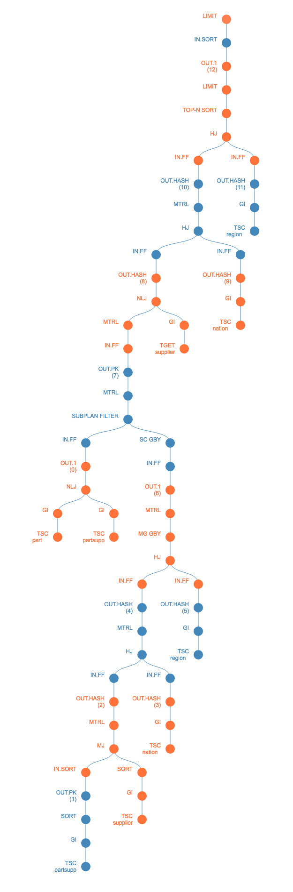

# Visualize OceanBase Explained Plan

## useage

 - git clone https://github.com/raywill/visual-explain.git plan
 - cd plan
 - open index.html (using Google Chrome is suggested)
 - paste your logical plan into textbox and click 'anlysis'

## visualized demo

 

## contact

 wechat: hustos

